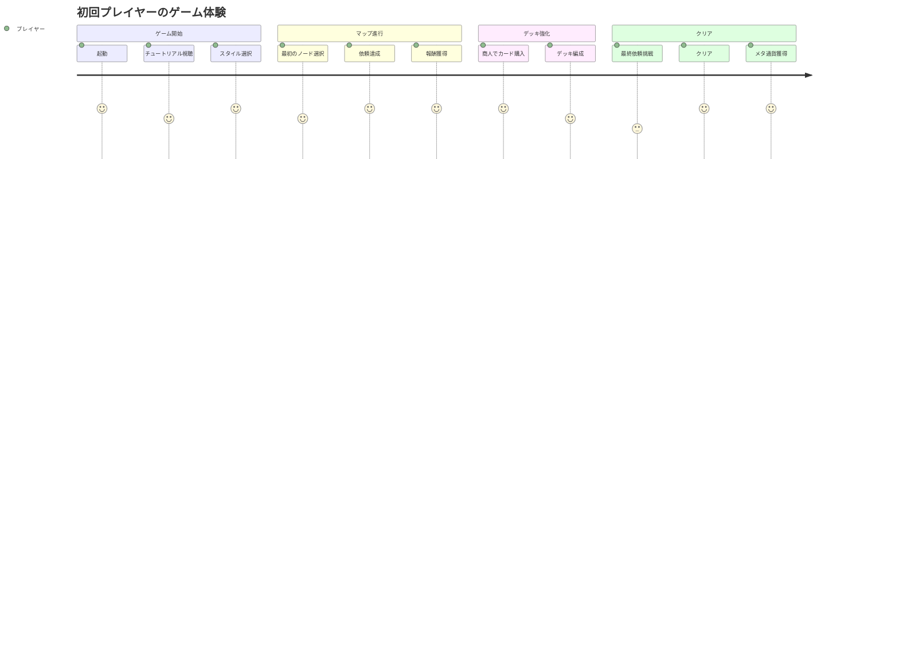
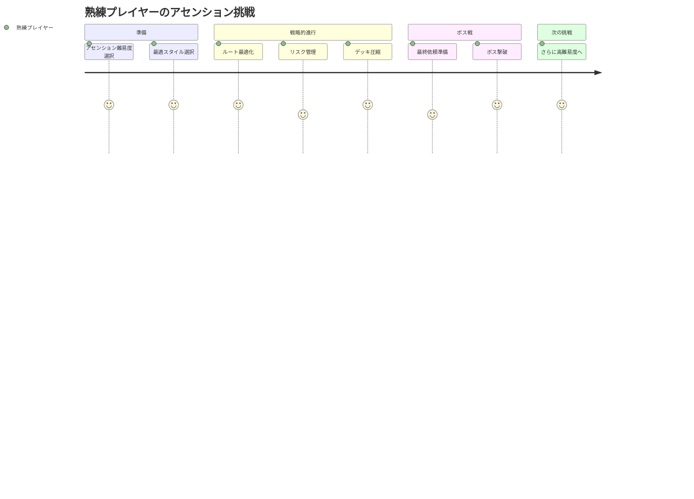

# アトリエ錬金術ゲーム ユーザストーリー

## 概要

このドキュメントは、錬金術×ローグライク×デッキ構築ゲーム「アトリエ」の詳細なユーザストーリーを記載する。

## ユーザー種別の定義

### プライマリユーザー

- **プレイヤー**: ゲームをプレイする一般ユーザー。錬金術師としてゲーム世界を冒険する。

### セカンダリユーザー

- **開発者**: ゲームのバランス調整やデバッグを行う。
- **テストプレイヤー**: プロトタイプ版をテストし、フィードバックを提供する。

---

## ユーザストーリー

**【信頼性レベル凡例】**:
- 🔵 **青信号**: EARS要件定義書・設計文書・ユーザヒアリングを参考にした確実なストーリー
- 🟡 **黄信号**: EARS要件定義書・設計文書・ユーザヒアリングから妥当な推測によるストーリー
- 🔴 **赤信号**: EARS要件定義書・設計文書・ユーザヒアリングにない推測によるストーリー

---

### 📚 エピック1: ゲーム開始とスタイル選択 🔵

#### ストーリー1.1: 錬金スタイルの選択 🔵

**ユーザストーリー**:
- **私は** 新規プレイヤー **として**
- **ゲーム開始時に**
- **自分のプレイスタイルに合った錬金スタイルを選択したい**
- **そうすることで** 初期デッキが決まり、自分好みの戦略でゲームを始められる

**詳細説明**:
- **背景**: 錬金スタイルによって初期カードと戦略が大きく異なるため、選択が重要
- **前提条件**: ゲームを起動し、「新規ゲーム」を選択した状態
- **利用シーン**: 初回プレイ時、または新しい周回を開始する時
- **期待する体験**: 各スタイルの特徴が分かりやすく表示され、直感的に選べる

**関連要件**: REQ-014, REQ-019, REQ-020

**優先度**: 高

**見積もり**: 3ストーリーポイント

---

#### ストーリー1.2: チュートリアルの受講 🔴

**ユーザストーリー**:
- **私は** 初心者プレイヤー **として**
- **ゲーム開始直後に**
- **基本操作とカードシステムを学びたい**
- **そうすることで** スムーズにゲームプレイを開始できる

**詳細説明**:
- **背景**: カードゲームに不慣れなプレイヤーでも楽しめるように
- **前提条件**: 初回プレイまたはチュートリアルを再表示
- **利用シーン**: ゲーム開始直後
- **期待する体験**: 段階的に操作を学べ、スキップも可能

**関連要件**: NFR-006

**優先度**: 中

**見積もり**: 5ストーリーポイント

---

### 📚 エピック2: マップ進行とノード選択 🔵

#### ストーリー2.1: ノードの選択 🔵

**ユーザストーリー**:
- **私は** プレイヤー **として**
- **マップ画面で次に進むノードを選択する際に**
- **各ノードの種類と報酬を確認してルートを決めたい**
- **そうすることで** 戦略的にデッキを強化できる

**詳細説明**:
- **背景**: ノード選択がデッキ構築の鍵となる
- **前提条件**: マップ画面が表示されている
- **利用シーン**: 依頼達成後、次のノードへ進む時
- **期待する体験**: ノードアイコンが分かりやすく、選択肢が明確

**関連要件**: REQ-015, REQ-016, REQ-046

**優先度**: 高

**見積もり**: 5ストーリーポイント

---

#### ストーリー2.2: 商人での買い物 🔵

**ユーザストーリー**:
- **私は** プレイヤー **として**
- **商人ノードに到達した時に**
- **所持金でカードを購入したり強化したりしたい**
- **そうすることで** デッキを自分好みに調整できる

**詳細説明**:
- **背景**: デッキ構築の自由度を高める
- **前提条件**: 商人ノードを選択し、通貨を所持している
- **利用シーン**: マップ進行中、戦力を強化したい時
- **期待する体験**: カードのラインナップが充実し、選択肢が豊富

**関連要件**: REQ-016, REQ-037

**優先度**: 高

**見積もり**: 8ストーリーポイント

---

#### ストーリー2.3: 実験ノードでのリスク選択 🔵

**ユーザストーリー**:
- **私は** プレイヤー **として**
- **実験ノードに到達した時に**
- **ランダムイベントに挑戦してリスクとリターンを楽しみたい**
- **そうすることで** 成功すれば強力な報酬、失敗すれば暴発というギャンブル要素を味わえる

**詳細説明**:
- **背景**: ゲームにランダム性と緊張感を加える
- **前提条件**: 実験ノードを選択
- **利用シーン**: リスクを取ってでも強化したい時
- **期待する体験**: 成功・失敗の確率が分かり、選択の重みを感じられる

**関連要件**: REQ-016

**優先度**: 中

**見積もり**: 5ストーリーポイント

---

### 📚 エピック3: 顧客依頼の達成(戦闘) 🔵

#### ストーリー3.1: 複数依頼の管理 🔵

**ユーザストーリー**:
- **私は** プレイヤー **として**
- **同時に3件の依頼を受けている状態で**
- **手札のカードをどの依頼に割り当てるか戦略的に決めたい**
- **そうすることで** 効率よく複数の依頼を達成できる

**詳細説明**:
- **背景**: 複数依頼制がゲームのコア戦略
- **前提条件**: 依頼ノードに到達し、依頼が3件表示されている
- **利用シーン**: 各ターン、カードを使用する時
- **期待する体験**: 依頼の進行状況が視覚的に分かりやすい

**関連要件**: REQ-029, REQ-030, REQ-045

**優先度**: 高

**見積もり**: 13ストーリーポイント

---

#### ストーリー3.2: 暴発のリスク管理 🔵

**ユーザストーリー**:
- **私は** プレイヤー **として**
- **カードをプレイする際に**
- **安定値を計算して暴発を避けるか、あえてリスクを取るか選びたい**
- **そうすることで** 安全策と高リスク高リターンの戦略を使い分けられる

**詳細説明**:
- **背景**: 安定値の管理がゲームの重要な要素
- **前提条件**: 手札にカードがある状態
- **利用シーン**: 各ターン、カードを選択する時
- **期待する体験**: 安定値が視覚的に分かり、閾値を把握できる

**関連要件**: REQ-023, REQ-033, EDGE-005

**優先度**: 高

**見積もり**: 8ストーリーポイント

---

#### ストーリー3.3: 依頼の達成と報酬獲得 🔵

**ユーザストーリー**:
- **私は** プレイヤー **として**
- **依頼の条件を満たした時に**
- **達成感を味わい、報酬として新しいカードを獲得したい**
- **そうすることで** デッキが強化され、次の挑戦に備えられる

**詳細説明**:
- **背景**: 報酬がプレイの動機付けとなる
- **前提条件**: 依頼の条件を満たした
- **利用シーン**: 依頼達成時
- **期待する体験**: 達成時のエフェクトと報酬の選択が楽しい

**関連要件**: REQ-034, REQ-036

**優先度**: 高

**見積もり**: 5ストーリーポイント

---

### 📚 エピック4: カードの収集と強化 🔵

#### ストーリー4.1: カードの入手 🔵

**ユーザストーリー**:
- **私は** プレイヤー **として**
- **依頼達成や商人での購入を通じて**
- **新しいカードを集めてコレクションを充実させたい**
- **そうすることで** 多様な戦略を試せるようになる

**詳細説明**:
- **背景**: カード収集がプレイの楽しみの一つ
- **前提条件**: 依頼達成または商人ノード到達
- **利用シーン**: ゲーム進行中
- **期待する体験**: 新カード入手時の演出が嬉しい

**関連要件**: REQ-036, REQ-037

**優先度**: 高

**見積もり**: 5ストーリーポイント

---

#### ストーリー4.2: カードの合成・進化 🔵

**ユーザストーリー**:
- **私は** プレイヤー **として**
- **同じカードを複数枚集めた時に**
- **それらを合成してより強力なカードに進化させたい**
- **そうすることで** デッキの質を高められる

**詳細説明**:
- **背景**: 合成システムが長期的な成長要素
- **前提条件**: 同じカードを複数枚所持している
- **利用シーン**: デッキ編成画面やキャンプ時
- **期待する体験**: 合成の演出が派手で達成感がある

**関連要件**: REQ-025, REQ-027

**優先度**: 中

**見積もり**: 8ストーリーポイント

---

### 📚 エピック5: メタ進行とやり込み 🔵

#### ストーリー5.1: メタ通貨の蓄積 🔵

**ユーザストーリー**:
- **私は** プレイヤー **として**
- **プレイを重ねることで名声と知識ポイントを貯め**
- **永続的なアンロック要素を解放したい**
- **そうすることで** 周回プレイのモチベーションが保たれる

**詳細説明**:
- **背景**: メタ進行がリプレイ性を高める
- **前提条件**: プレイを終了し、結果画面が表示されている
- **利用シーン**: 1プレイ終了時
- **期待する体験**: 次の周回への期待が高まる

**関連要件**: REQ-039, REQ-011

**優先度**: 中

**見積もり**: 8ストーリーポイント

---

#### ストーリー5.2: 新要素のアンロック 🔵

**ユーザストーリー**:
- **私は** プレイヤー **として**
- **メタ通貨を使って**
- **新しいカード、素材、顧客をアンロックしたい**
- **そうすることで** ゲームの幅が広がり、新鮮な体験ができる

**詳細説明**:
- **背景**: アンロック要素がゲームの奥深さを提供
- **前提条件**: メタ通貨を一定量貯めている
- **利用シーン**: タイトル画面や工房画面
- **期待する体験**: アンロック要素が段階的に増え、発見の喜びがある

**関連要件**: REQ-040, REQ-044

**優先度**: 中

**見積もり**: 13ストーリーポイント

---

#### ストーリー5.3: アセンション難易度への挑戦 🔵

**ユーザストーリー**:
- **私は** 熟練プレイヤー **として**
- **周回ごとに難易度を上げて**
- **より高難易度のチャレンジに挑戦したい**
- **そうすることで** 長期的なやりこみ要素を楽しめる

**詳細説明**:
- **背景**: アセンションシステムがエンドコンテンツ
- **前提条件**: 1周クリアしている
- **利用シーン**: 新規ゲーム開始時
- **期待する体験**: 難易度が上がるごとに達成感が増す

**関連要件**: REQ-041, REQ-043

**優先度**: 低

**見積もり**: 8ストーリーポイント

---

### 📚 エピック6: セーブ・ロードとゲーム管理 🔵

#### ストーリー6.1: 途中セーブ 🔵

**ユーザストーリー**:
- **私は** プレイヤー **として**
- **プレイ途中でゲームを中断する際に**
- **現在の状態を保存して後で再開したい**
- **そうすることで** 時間に縛られずマイプースでプレイできる

**詳細説明**:
- **背景**: 20〜40分のプレイ時間でも中断が必要な場合がある
- **前提条件**: ゲームプレイ中
- **利用シーン**: 時間がなくなった時、用事ができた時
- **期待する体験**: ワンクリックで保存でき、次回すぐに再開できる

**関連要件**: REQ-012

**優先度**: 高

**見積もり**: 5ストーリーポイント

---

#### ストーリー6.2: シード値の共有 🔵

**ユーザストーリー**:
- **私は** プレイヤー **として**
- **面白いマップ構成やカード配置に出会った時に**
- **シード値を記録して友人と共有したい**
- **そうすることで** 同じ条件でプレイを競い合える

**詳細説明**:
- **背景**: シード値機能がコミュニティ形成を促す
- **前提条件**: ゲーム開始時またはプレイ中
- **利用シーン**: 面白い配置を見つけた時
- **期待する体験**: シード値のコピーが簡単で、入力も楽

**関連要件**: REQ-042

**優先度**: 低

**見積もり**: 3ストーリーポイント

---

### 📚 エピック7: UI操作と設定 🟡

#### ストーリー7.1: 音量調整 🔴

**ユーザストーリー**:
- **私は** プレイヤー **として**
- **設定画面で**
- **BGMとSEの音量を個別に調整したい**
- **そうすることで** 自分好みの音響環境でプレイできる

**詳細説明**:
- **背景**: 音量調整はゲームの基本機能
- **前提条件**: 設定画面にアクセス
- **利用シーン**: 初回プレイ時、環境に合わせたい時
- **期待する体験**: スライダーで直感的に調整できる

**関連要件**: REQ-050

**優先度**: 中

**見積もり**: 2ストーリーポイント

---

#### ストーリー7.2: キーボード操作 🔵

**ユーザストーリー**:
- **私は** プレイヤー **として**
- **マウスを使わずに**
- **キーボードだけでゲームを操作したい**
- **そうすることで** より素早く快適にプレイできる

**詳細説明**:
- **背景**: 操作効率を高めたいプレイヤーのニーズ
- **前提条件**: ゲームプレイ中
- **利用シーン**: 慣れてきた後、効率重視のプレイ時
- **期待する体験**: ショートカットキーが充実している

**関連要件**: REQ-005

**優先度**: 中

**見積もり**: 5ストーリーポイント

---

## ユーザージャーニー

### ジャーニー1: 初回プレイの流れ 🔵



**詳細**:
1. **起動**: ゲームが5秒以内に起動し、タイトル画面が表示される
2. **チュートリアル視聴**: 基本操作を学ぶ(スキップ可能)
3. **スタイル選択**: 自分のプレイスタイルに合った錬金スタイルを選ぶ
4. **最初のノード選択**: マップを見て次のノードを選ぶ
5. **依頼達成**: 3件の依頼を管理しながらカードをプレイ
6. **報酬獲得**: 新しいカードを獲得してデッキが強化される
7. **商人でカード購入**: 通貨を使ってデッキを調整
8. **デッキ編成**: 不要なカードを整理
9. **最終依頼挑戦**: 高難易度の依頼に挑戦
10. **クリア**: 達成感を味わう
11. **メタ通貨獲得**: 次回プレイへの期待が高まる

---

### ジャーニー2: 熟練プレイヤーのやりこみ 🔵



**詳細**:
1. **アセンション難易度選択**: より高い難易度に挑戦
2. **最適スタイル選択**: 難易度に合わせた最適なスタイルを選ぶ
3. **ルート最適化**: カード獲得効率を最大化するルートを選ぶ
4. **リスク管理**: 安定値を計算しながら最適な手札を選ぶ
5. **デッキ圧縮**: 不要なカードを減らして強力なカードの引き率を上げる
6. **最終依頼準備**: ボス戦に向けてデッキを完成させる
7. **ボス撃破**: 高難易度をクリアする達成感
8. **さらに高難易度へ**: 次のアセンションレベルに挑戦

---

## ペルソナ定義

### ペルソナ1: カジュアルプレイヤー・太郎 🔴

- **基本情報**: 28歳、会社員、ゲーム経験は中程度
- **ゴール**: 仕事の合間に20〜30分で気軽に遊びたい
- **課題**: 時間が限られているため、長時間プレイは難しい
- **行動パターン**: 週に2〜3回、夜にプレイ。難易度は低めを好む
- **利用環境**: Windows デスクトップPC、マウス操作メイン

### ペルソナ2: やりこみプレイヤー・花子 🔴

- **基本情報**: 24歳、学生、ローグライクゲーム好き
- **ゴール**: 全てのアセンションレベルをクリアしたい
- **課題**: 高難易度でのデッキ構築戦略を模索中
- **行動パターン**: 毎日プレイ、配信も視聴、コミュニティで情報交換
- **利用環境**: Windows ノートPC、キーボード操作メイン

### ペルソナ3: デッキビルダー・次郎 🔴

- **基本情報**: 32歳、フリーランス、TCG・デッキ構築ゲーム愛好家
- **ゴール**: 面白いコンボやアーキタイプを発見したい
- **課題**: カードの組み合わせが多すぎて、最適解を見つけるのが大変
- **行動パターン**: じっくり時間をかけてデッキを研究、シード値を記録
- **利用環境**: Windows デスクトップPC、マウス+キーボード

---

## 非機能的ユーザー要求

### ユーザビリティ要求

- **学習容易性**: チュートリアルを見れば30分以内に基本操作を習得できる
- **効率性**: 熟練後は1プレイを20分以内で完了できる
- **記憶しやすさ**: 1週間ぶりでも操作方法を思い出せる
- **エラー対応**: 誤操作してもアンドゥ機能で戻せる
- **満足度**: カード獲得時やクリア時に達成感を感じられる

### アクセシビリティ要求

- **視覚**: 最低限の色覚多様性対応(カードの属性を色だけでなくアイコンでも識別可能)
- **聴覚**: 音声がなくてもゲームプレイに支障がない
- **運動**: マウスのみ、キーボードのみでも操作可能
- **認知**: チュートリアルがあり、ヘルプ機能でいつでも確認可能

---

## ストーリーマップ

```
エピック1: ゲーム開始
  └─ 1.1 スタイル選択 [高]
  └─ 1.2 チュートリアル [中]

エピック2: マップ進行
  └─ 2.1 ノード選択 [高]
  └─ 2.2 商人での買い物 [高]
  └─ 2.3 実験ノード [中]

エピック3: 顧客依頼(戦闘)
  └─ 3.1 複数依頼の管理 [高] ← MVP最重要
  └─ 3.2 暴発のリスク管理 [高]
  └─ 3.3 依頼達成と報酬 [高]

エピック4: カード収集・強化
  └─ 4.1 カードの入手 [高]
  └─ 4.2 カード合成・進化 [中]

エピック5: メタ進行
  └─ 5.1 メタ通貨の蓄積 [中]
  └─ 5.2 新要素のアンロック [中]
  └─ 5.3 アセンション挑戦 [低]

エピック6: セーブ・ロード
  └─ 6.1 途中セーブ [高]
  └─ 6.2 シード値共有 [低]

エピック7: UI・設定
  └─ 7.1 音量調整 [中]
  └─ 7.2 キーボード操作 [中]
```

---

## MVP(最小限の製品)に含まれるストーリー

1. **1.1 スタイル選択** (最低1スタイルのみ実装)
2. **2.1 ノード選択** (依頼・商人のみ)
3. **2.2 商人での買い物**
4. **3.1 複数依頼の管理** ← コアシステム
5. **3.2 暴発のリスク管理** ← コアシステム
6. **3.3 依頼達成と報酬**
7. **4.1 カードの入手**
8. **6.1 途中セーブ**

**MVP範囲外(正式リリースで実装)**:
- チュートリアル
- 実験ノード、魔物ノード
- カード合成・進化
- メタ進行システム
- アセンション
- シード値機能

---

## 変更履歴

| 日付 | バージョン | 変更内容 |
|------|----------|---------|
| 2025-11-08 | 1.0 | 初版作成 |

