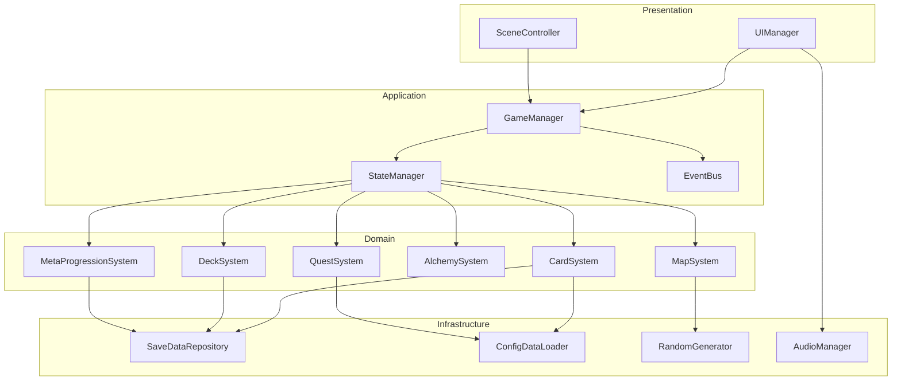
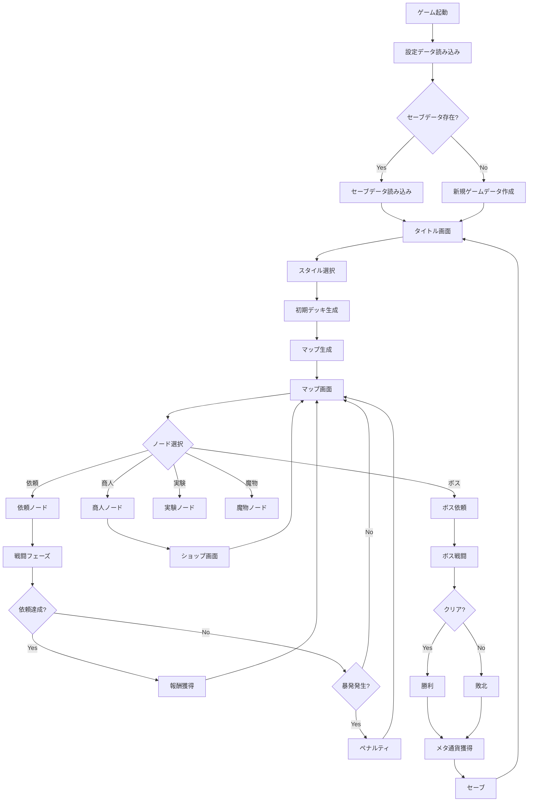
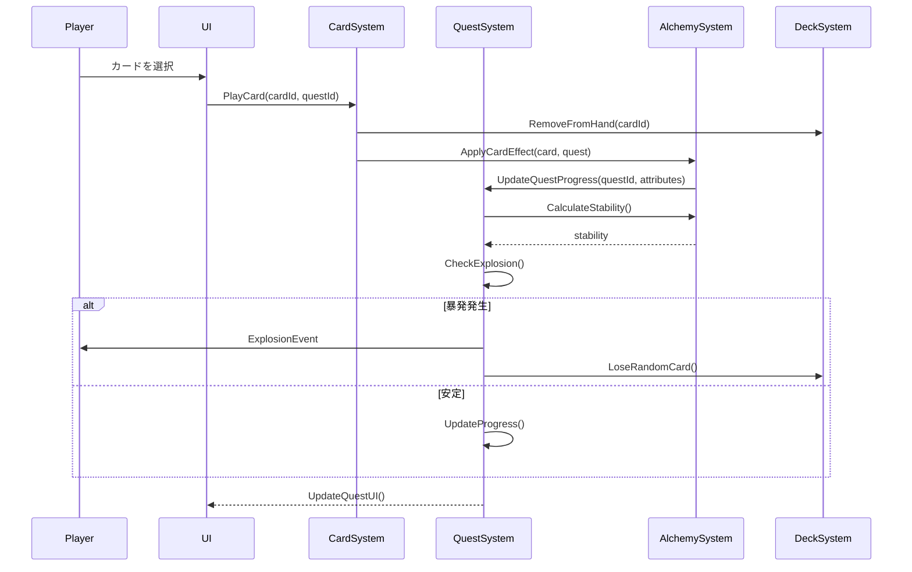
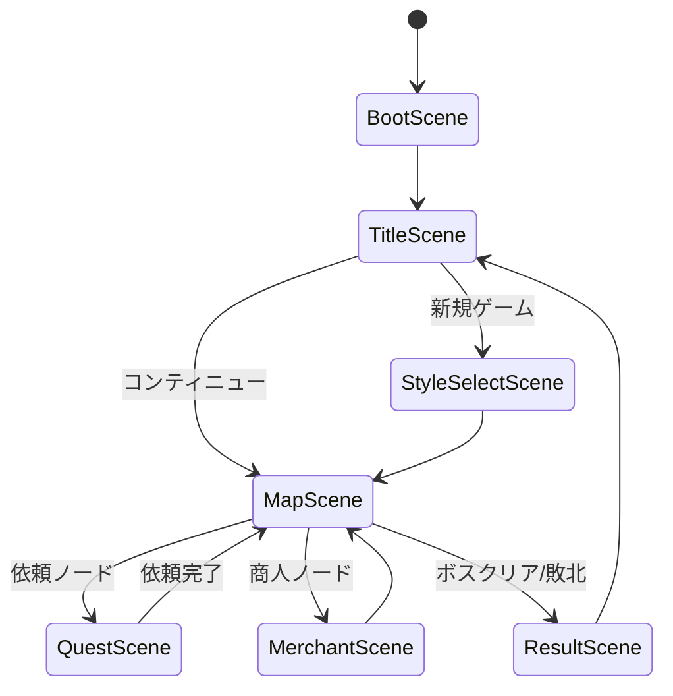

# システムアーキテクチャ設計

## システムアーキテクチャ

### レイヤー構造

```
┌─────────────────────────────────────────────┐
│          Presentation Layer                 │
│  (UI/View/MonoBehaviour Components)         │
│  - SceneControllers                         │
│  - UIViews                                  │
│  - AnimationControllers                     │
└─────────────────────────────────────────────┘
                    ↓↑
┌─────────────────────────────────────────────┐
│         Application Layer                   │
│  (Game Logic/State Management)              │
│  - GameManager                              │
│  - StateManager                             │
│  - EventBus                                 │
└─────────────────────────────────────────────┘
                    ↓↑
┌─────────────────────────────────────────────┐
│           Domain Layer                      │
│  (Business Logic/Core Systems)              │
│  - CardSystem                               │
│  - QuestSystem (顧客依頼)                   │
│  - DeckSystem                               │
│  - AlchemySystem (錬金システム)              │
│  - MapSystem                                │
│  - MetaProgressionSystem                    │
└─────────────────────────────────────────────┘
                    ↓↑
┌─────────────────────────────────────────────┐
│      Infrastructure Layer                   │
│  (Data Access/External Systems)             │
│  - SaveDataRepository                       │
│  - ConfigDataLoader                         │
│  - RandomGenerator (シード管理)              │
│  - AudioManager                             │
└─────────────────────────────────────────────┘
```

### コンポーネント図



## データフロー図

### ゲーム全体のデータフロー



### カードプレイのデータフロー



## Unityシーン構成

### シーン一覧

| シーン名 | 説明 | 主要な要素 |
|---------|------|-----------|
| **BootScene** | 初期化・ロード画面 | - 設定データ読み込み<br>- セーブデータ確認<br>- DontDestroyOnLoad のマネージャー生成 |
| **TitleScene** | タイトル画面 | - 新規ゲーム<br>- コンティニュー<br>- 設定<br>- メタアンロック画面 |
| **StyleSelectScene** | スタイル選択 | - スタイル一覧表示<br>- 初期デッキプレビュー |
| **MapScene** | マップ進行 | - ノード配置<br>- ルート選択<br>- 現在位置表示 |
| **QuestScene** | 依頼達成(戦闘) | - 依頼ボード(3件)<br>- 手札表示<br>- デッキ/捨て札状態<br>- 錬金釜エリア |
| **MerchantScene** | 商人ノード | - カード購入<br>- カード強化<br>- カード削除 |
| **ResultScene** | リザルト画面 | - 獲得報酬表示<br>- メタ通貨獲得<br>- 統計情報 |

### シーン遷移図


